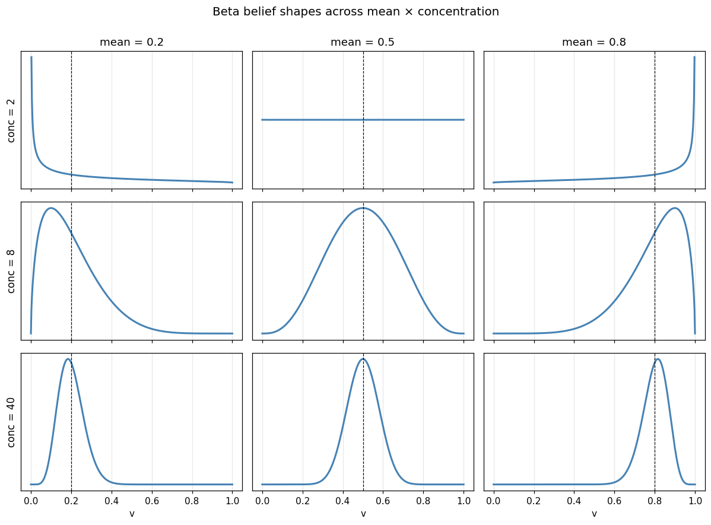
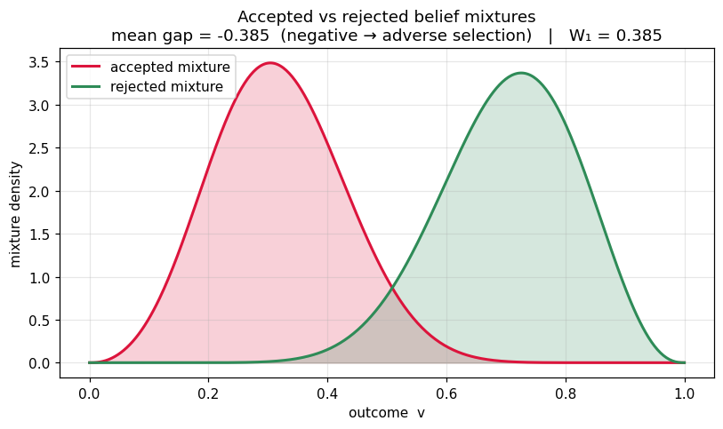

# beta-swarm

**Distributional safety with a full belief over a continuous outcome.**

A generalization of the soft-label formalism in
[`distributional-agi-safety`](https://github.com/swarm-ai-safety/swarm). Where
that framework carries a single scalar `p = P(v = +1)` per interaction, an agent
here carries a parameterized **distribution** over a continuous quality
`v ∈ [0, 1]`:

$$F = \mathrm{Beta}(\alpha, \beta)$$

That belief decomposes into two interpretable quantities:

| Quantity | Formula | Recovers / adds |
|---|---|---|
| **mean** | `α / (α + β)` | the old point estimate `p` |
| **concentration** | `α + β` | *new:* epistemic uncertainty |

This separates two situations the scalar formalism collapses into one number:

- **confident the interaction is mediocre** — mean ≈ 0.5, high concentration
- **uncertain whether it's great or terrible** — mean ≈ 0.5, low concentration

Both have `p = 0.5`. They differ entirely in their downside tail mass.

> 📓 The figures throughout this README are generated by
> [`examples/belief_shapes.ipynb`](examples/belief_shapes.ipynb) — a runnable
> visual tour of the belief shapes, the governance lever, and the quality gap.



A catalog of the shapes a belief can take. **Down a column** the mean is fixed
and concentration grows, so the belief sharpens around the same point;
**across a row** concentration is fixed and the mean shifts. The top row
(concentration 2) is the diffuse, "we don't know yet" regime — the same row a
scalar `p` would report as a confident `0.2` / `0.5` / `0.8`. Generated by
[`examples/belief_shapes.ipynb`](examples/belief_shapes.ipynb).

## What the generalization buys you

| Concept | Scalar `p` | beta-swarm |
|---|---|---|
| Quality label | `p ∈ [0, 1]` | `Beta(α, β)` over `v ∈ [0, 1]` |
| Payoff | `S_soft = p·s₊ − (1−p)·s₋` | `E_F[surplus(v)]` |
| Governance lever | threshold on `p` | tail mass `P(v < τ)`, Value-at-Risk |
| Quality gap | `E[p\|acc] − E[p\|rej]` | Wasserstein-1 / KL between accepted & rejected belief distributions |
| Calibration | Brier score | CRPS (continuous proper score) |

### The lever, visualized


The governor's lever is just a height on the CDF: at the threshold `τ`, the
value of each cumulative curve *is* its tail mass `P(v < τ)`. The two same-mean
beliefs cross near the mean but separate sharply at the left — the sharp belief
reads `0.000`, the diffuse one `0.250`. Sweeping that reading across all beliefs
gives the contour below.


Tail mass `P(v < τ)` across the whole belief space: mean on the x-axis (the
legacy point estimate `p`), concentration on the log y-axis. The black curve is
a tail-mass governor's admission boundary (`max_tail_mass = 0.15`). It is a
**curve, not a vertical line** — at a fixed mean, dropping concentration inflates
the downside tail, so a less-certain belief must clear a higher mean to be
admitted. The two marked beliefs share `mean = 0.5` yet land on opposite sides
of the boundary; a mean-only policy cannot separate them. Generated by
[`examples/belief_shapes.ipynb`](examples/belief_shapes.ipynb).

### The quality gap, as a distance between distributions



The scalar gap `E[p|acc] − E[p|rej]` is a single signed number. With full
beliefs the question becomes *how far apart are the accepted and rejected
populations as distributions* — answered by the Wasserstein-1 distance between
their belief mixtures. Above, an adversely-selected market accepts the
lower-quality interactions (red) and rejects the higher-quality ones (green):
the **negative mean gap** flags the adverse selection, while **W₁** quantifies
the separation. Generated by
[`examples/belief_shapes.ipynb`](examples/belief_shapes.ipynb).

Every distributional quantity **reduces to the scalar one** when the surplus is
linear and the belief is sharp — beta-swarm is a strict superset. The payoff
only departs from the mean-based value when the surplus is **nonlinear**, at
which point the *shape* of the belief (not just its mean) moves the payoff. A
convex downside penalty, for instance, makes a diffuse "great-or-terrible"
belief strictly worse than a sharp "mediocre" one with the same mean.

## Install

```bash
pip install -e ".[dev]"
```

## Quickstart

```python
from beta_swarm import BetaBelief, TailMassGovernor

confident_mediocre = BetaBelief.from_mean_concentration(mean=0.5, concentration=200)
uncertain          = BetaBelief.from_mean_concentration(mean=0.5, concentration=2)

# Same mean — a scalar-p policy cannot tell them apart:
assert confident_mediocre.mean == uncertain.mean == 0.5

# But the downside tail mass is completely different:
confident_mediocre.tail_mass(0.25)   # -> 0.000
uncertain.tail_mass(0.25)            # -> 0.250

# A tail-mass governor rejects the risky one and admits the reliable one:
gov = TailMassGovernor(tau=0.25, max_tail_mass=0.15)
gov.accepts(confident_mediocre)   # True
gov.accepts(uncertain)            # False
```

[`examples/demo.py`](examples/demo.py) runs the full side-by-side:

```text
Two beliefs, identical mean (= the legacy point estimate p):

  confident-mediocre  BetaBelief(alpha=100, beta=100 | mean=0.500, conc=200)
  uncertain           BetaBelief(alpha=1, beta=1 | mean=0.500, conc=2)

Downside tail mass  P(v < 0.25):
  confident-mediocre  0.000
  uncertain           0.250

Tail-mass governor (reject if P(v<0.25) > 0.15):
  confident-mediocre  ACCEPT   (P(v < 0.25) = 0.000 within tolerance)
  uncertain           REJECT   (P(v < 0.25) = 0.250 > 0.150: downside risk too high)

Expected surplus with a convex downside penalty (gamma=2):
  confident-mediocre  +0.749
  uncertain           +0.667

5%-Value-at-Risk outcome (the quality you can count on 95% of the time):
  confident-mediocre  0.442
  uncertain           0.050
```

For the visual tour of the same results, see
[`examples/belief_shapes.ipynb`](examples/belief_shapes.ipynb) (belief shapes,
the CDF tail the governor reads, the tail-mass contour, and the
accepted-vs-rejected quality gap as a distance between distributions).

## Closing the loop: simulation

The parent SWARM framework's central lesson is that safety phenomena are
*emergent* — you only see them by running populations of behavioral archetypes
through a governed interaction loop. `beta_swarm.simulation` ports that loop
and generalizes three of its mechanisms to distributions:

- **Reputation is a belief.** The governor keeps a `BetaBelief` per agent,
  conjugately updated with realized outcomes. Reputation decay becomes
  *concentration* decay: a neglected reputation diffuses back toward
  "we don't know", rather than sliding toward a default score.
- **Evidence pools.** The per-interaction proxy belief and the initiator's
  reputation belief combine by adding pseudo-counts (`pool_beliefs`).
- **Audits add evidence.** A `DEFER` verdict routes the interaction to an audit
  that injects pseudo-counts of the (noisily observed) true outcome, sharpening
  the belief before the governor re-decides — at a cost that falls on unproven
  agents and fades as their reputation concentrates.

The agent population distills SWARM's fifty-odd archetypes to the three that
matter distributionally — honest, mediocre, and **deceptive**. A deceptive
agent inflates the *level* of its observables (reports high progress, hides
rework and verifier events) but cannot fake the *volume* of evidence, so its
beliefs arrive with a high mean and low concentration. That diffuse shape is
the distributional fingerprint of deception — invisible to scalar `p`.

[`examples/governor_showdown.py`](examples/governor_showdown.py) runs the same
seeded population under the legacy mean-threshold lever and the tail-mass
lever:

```text
                           mean governor   tail governor
--------------------------------------------------------
realized welfare                   +69.8          +147.6
realized toxicity                  0.380           0.344
audits run                             0             521
mean CRPS (calibration)           0.1011          0.0593

Acceptance rate by archetype:
  honest                100%             99%
  mediocre               88%             74%
  deceptive              12%              0%

Epoch 0 deceptive acceptance — mean governor: 73%, tail governor: 0%.
```

The mean governor admits deceptive work wholesale until pooled reputation drags
each agent's mean under the bar — paying for the damage it learns from, and
letting reputation decay re-admit them intermittently forever. The tail
governor defers exactly the diffuse beliefs to audit and shuts deception out
from epoch 0, before any reputation exists. (One tuning constraint: the defer
threshold must be reachable by a single audit — roughly base concentration +
`audit_strength` — or every interaction loops `DEFER → REJECT` and the
ecosystem shuts down.)

## Collusion: the fingerprint is in the shape

The parent framework's collusion detector uses two scalar signals — unusual
pair frequency, and quality asymmetry (high `p` inside the ring, low `p`
outside). A competent ring defeats the second by lying to *everyone*: belief
means inside and outside the ring come out nearly identical.

The distributional fingerprint survives, because **corroboration is
evidence**. A ring counterparty actively confirms the inflated signals with
faked engagement — the one channel a lone deceiver cannot manufacture — so
within-ring beliefs arrive with the same mean but systematically *higher
concentration*. `CollusionDetector` reads that shape asymmetry (Wasserstein-1
between within-pair and arm's-length belief mixtures, concentration lift, tail
asymmetry) alongside the graph signal (frequency lift).

[`examples/collusion_ring.py`](examples/collusion_ring.py) hides a three-agent
ring in a mixed population under a permissive mean-threshold governor:

```text
pair                           n   freq  mean gap  W1 gap   conc  suspicion
---------------------------------------------------------------------------
colluder-0 -> colluder-1      45   4.0x    +0.050   0.050  1.38x      0.201
colluder-2 -> colluder-1      46   4.1x    +0.046   0.046  1.36x      0.192
colluder-1 -> colluder-0      52   4.7x    +0.040   0.040  1.33x      0.188
...

Ring pairs flagged: 6/6; false positives: 0.
```

The scalar tell is a mean gap of +0.05; the shape tells are a 1.35x
concentration lift and the missing downside tail. Two log-design lessons made
this work: score the **per-interaction evidence belief** (`proxy_belief`), not
the reputation-pooled decision belief — a shared prior enters every pooled
belief identically and smears out per-pair contrast — and baseline each pair
against the initiator's **arm's-length traffic** only, or fellow ring members
contaminate the comparison.

## Calibration: is the belief an honest forecast?

The parent framework's calibration arm bins predicted probability against
realized frequency (reliability diagram, ECE/MCE, Brier). Each piece
generalizes to a full distribution:

| Scalar `p` | beta-swarm |
|---|---|
| reliability diagram | **PIT histogram** — `F(v_true)` is uniform iff calibrated; its shape diagnoses the failure (U = overconfident, hump = underconfident, slope = mean bias) |
| binned ECE / MCE | **tail-mass reliability** — bin by predicted `P(v < τ)`, compare to the empirical bad-outcome rate: does the governance lever mean what it says? |
| Brier score | **CRPS** |
| — | **sharpness** — mean concentration, maximized *subject to* calibration |

[`examples/calibration_reliability.py`](examples/calibration_reliability.py)
runs the fidelity harness (the agent emission models are the conditional
generative model) and finds:

1. **The default proxy is underconfident** on faithful traffic: where the
   lever reads 15% downside risk, the realized bad rate is under 1% — honest
   agents pay for phantom risk.
2. **The concentration knob has a calibrated optimum.** A paired sweep of
   `evidence_scale` (same draws, only the sharpening differs) bottoms out
   around 14–20 — the default 1.5 is ~10x too timid — then degrades as
   overconfidence sets in. This is the tunable the scalar formalism never had.
3. **Deceptive traffic destroys calibration in a localized way**: 98% of PIT
   mass lands in the bottom bin (outcomes below the belief's entire support).
   Miscalibration that localized is a fingerprint, not noise.
4. **Governance is what calibrates the beliefs.** The raw proxy is equally
   miscalibrated under both showdown governors (tail ECE ≈ 0.31), but audits
   and reputation pooling repair the tail governor's decision beliefs to
   tail ECE 0.034 — a 9x more honest lever than the mean governor's 0.173.

## Red-teaming: attacking the load-bearing assumption

Every defense above rests on one assumption — **deception cannot fake evidence
volume**, so a malicious interaction's belief arrives *diffuse* and gets
deferred to audit. `beta_swarm.redteam` ports the parent framework's attack
library and evaluator to break exactly that assumption.
[`examples/redteam_report.py`](examples/redteam_report.py) runs three attacks
against the standard tail governor:

```text
  attack              category       evasion  audit-ev  damage  detect
  --------------------------------------------------------------------
  volume_forgery      evasion           56%       99%     349   never
  reputation_farming  exploitation      77%       77%     189   ep 16
  collusion_ring      coordination       9%        0%      27   ep 19
```

- **Volume forgery** is the break. The proxy reads event *count* as evidence,
  so an adversary fabricates a pile of claimed-resolved rework events: the
  penalty signal saturates (the mean barely moves) but the concentration climbs
  past the DEFER threshold. The forged-sharp belief has almost no tail mass, so
  it is accepted **with no audit** — 56% evasion, 99% audit-evasion, never
  detected. And forged concentration is doubly nasty: even when an audit does
  fire, a fixed-strength audit can't overrule a belief that claims high
  confidence.
- **Reputation farming** does genuine work to bank reputation, then flips to
  poor work behind inflated signals — sustaining acceptance for a bounded
  exploitation window (~6 epochs past the flip here) before realized outcomes
  convict it. The window length *is* the detection latency.
- **Collusion ring** is contained by the tail gate and flagged by the shape
  detector from the section above.

The fix for volume forgery takes two layers, each closing one failure:

```text
  configuration          evasion  audit-ev  damage
  ------------------------------------------------
  vulnerable                56%       99%     349
  + scaled audit            52%       88%     318
  + concentration cap       10%        0%      29
  + both                     9%        0%      27
```

Scaling audit strength to the audited belief's concentration (so an audit can
always overrule the belief it checks) barely helps alone — the attack never
*triggers* an audit. The decisive fix is **capping the concentration a single
interaction may assert** (`BetaProxyComputer(max_concentration=...)`): sharpness
must be *earned* through audits and reputation pooling, not claimed in one shot.
That forces the forged belief back through the DEFER gate to audit, dropping
evasion from 56% to 10% and damage 12x. Both mitigations, plus a random-audit
floor, are `SimulationConfig` levers, so an attack and its patch run through the
same harness.

## Governance levers: accountability beyond the gate

The tail-mass governor decides admission *ex ante*, from the belief — and a
forged belief slips past it. `beta_swarm.levers` ports the parent framework's
composable lever pattern: each lever returns a `LeverEffect` (costs, freezes,
resource deltas), a `GovernanceStack` merges them, and levers fire at lifecycle
points (`on_epoch_start`, `on_interaction`, `can_act`). The distributional
generalizations act *ex post*, on realized outcomes, where no forged belief can
hide:

- **StakingLever** — participation costs a stake, slashed when accepted work's
  realized outcome lands below `tau`.
- **TailCircuitBreaker** — freeze an agent whose recent *realized* bad-outcome
  rate exceeds a bound (or its ex-ante belief tail mass, with `use_realized=False`).
- **RiskTaxLever** — a transaction tax priced on the belief's tail mass.

Because they judge ground truth rather than the projected belief, a staking +
circuit-breaker stack contains the attacks that beat the belief gate — **with no
concentration cap** ([`examples/governance_levers.py`](examples/governance_levers.py)):

```text
  attack                         evasion  blocked          damage
  -------------------------------------------------------------
  volume_forgery           56% -> 3%         97%     349 -> 20
  reputation_farming       77% -> 51%        47%     189 -> 26
  collusion_ring            9% -> 4%         68%      27 -> 15
```

Staking is the workhorse: skin in the game runs out for an agent whose accepted
work keeps coming up bad, so volume forgery's damage collapses 17x. Reputation
farming keeps a high evasion rate — its pre-flip work is genuinely good — but its
post-flip *damage* falls 7x. The accountability is **not free**, though: staking
also slashes an honest agent that occasionally underperforms, so honest
throughput dips (99% → 92%) and welfare with it. The circuit breaker (which
needs a *sustained* bad rate) is more targeted. Choosing the mix is the
governance design problem the levers exist to study.

## Adaptive governance: tuning the risk budget, reversibly

A fixed `max_tail_mass` is a guess, and a wrong guess costs you in both
directions. `beta_swarm.adaptive` ports the parent framework's adaptive
controller, which treats a threshold as something to *learn* from realized
outcomes — and treats every change as a **reversible experiment**: propose a
change, apply it temporarily, then *crystallize* it if outcomes sustain, else
*revert*. Governance changes must earn their keep.

The `AdaptiveController` steers the governor toward a policy target on
**realized** toxicity (`E[1 - v_true | accepted]`, ground truth — not the
belief the governor was shown). Dropped onto two badly misconfigured governors
and one correct one, all with the same target
([`examples/adaptive_governance.py`](examples/adaptive_governance.py)):

```text
  start                    max_tail_mass   realized toxicity
  ----------------------------------------------------------
  misconfigured loose      0.55 (static)               0.402
  -> adaptive              0.20  (tuned)               0.381    [7 kept, 3 reverted]

  misconfigured tight      0.05 (static)               0.341
  -> adaptive              0.20  (tuned)               0.367    [6 kept, 1 reverted]

  already correct          0.12 (static)               0.370
  -> adaptive              0.17  (tuned)               0.368    [4 kept, 4 reverted]
```

A static budget misses the target in both directions — too loose sits over the
risk appetite, too tight turns away good work for no safety gain. The controller
pulls both to the ~0.37 target *from opposite starts*, and leaves the correct
governor near where it began. The **reverted** proposals are the discipline that
makes it safe: a step that overshoots the target is rolled back, so the threshold
only keeps changes that earned their keep. (Two calibration notes the example's
population makes concrete: the target must be *reachable* — realized toxicity is
floored by the accepted population's true quality — and a warmup period is needed
so the controller tunes on steady state, not the reputation transient at the
start of a run.)

## Scenarios: a whole experiment as one file

Reproducibility rests on scenario files — a run is fully specified by a config
(population, proxy, payoff, governor, levers, controller, seed), so it can be
version-controlled, diffed, and replayed exactly. `beta_swarm.scenarios` loads a
YAML file into a wired `Simulation`; identical files with identical seeds produce
identical runs.

```yaml
scenario_id: volume_forgery_defended
seed: 7
population:
  - {archetype: honest, count: 4}
  - {archetype: mediocre, count: 3}
  - {archetype: volume_forger, count: 3, forge_volume: 10}
governor: {tau: 0.4, max_tail_mass: 0.2, defer_below_concentration: 20.0}
governance_stack:
  initial_resources: 5.0
  levers:
    - {type: staking, min_stake: 1.0, slash_rate: 0.5}
    - {type: circuit_breaker, max_tail_exposure: 0.5}
```

```bash
python examples/run_scenario.py scenarios/volume_forgery_defended.yaml
```

The population spec covers every archetype including the red-team adversaries
(`volume_forger`, `reputation_farmer`, `colluder`) and a `borderline` spread for
smooth control curves; the optional `governance_stack` and `adaptive` sections
wire in the lever stack and controller. The schema rejects unknown keys, so a
typo fails loudly instead of silently doing nothing, and a loaded scenario
reproduces the equivalent hand-built simulation to the interaction (both are
tested). Three scenarios ship in [`scenarios/`](scenarios): the governor
showdown, the defended forgery attack, and the adaptive retune.

## Package layout

| Module | Contents |
|---|---|
| `beta_swarm.belief` | `BetaBelief` — mean, concentration, tail mass, quantiles, conjugate updates |
| `beta_swarm.payoff` | `DistributionalPayoffEngine` — `E_F[surplus(v)]`, configurable downside curvature |
| `beta_swarm.governance` | `TailMassGovernor`, `ValueAtRiskGovernor` — risk-aware admission |
| `beta_swarm.metrics` | Wasserstein/KL quality gap, distributional toxicity, CRPS |
| `beta_swarm.proxy` | `BetaProxyComputer` — observables → belief (mean *and* concentration) |
| `beta_swarm.interaction` | `BetaInteraction` — interaction carrying a `BetaBelief` |
| `beta_swarm.agents` | `SimAgent` archetypes — honest, mediocre, deceptive, colluder emission models |
| `beta_swarm.simulation` | `Simulation` — governed epoch loop, belief reputation, audits, epoch metrics |
| `beta_swarm.collusion` | `CollusionDetector` — ring detection from belief-shape asymmetry |
| `beta_swarm.calibration` | PIT histograms, tail-mass reliability, CRPS, `evidence_scale` sweeps |
| `beta_swarm.redteam` | `AttackLibrary` — volume forgery, reputation farming, collusion ring; `run_attack` evaluator |
| `beta_swarm.levers` | `GovernanceStack` — staking, tail circuit breaker, risk tax; composable ex-post accountability |
| `beta_swarm.adaptive` | `AdaptiveController` — tune the risk budget to a realized-risk target, crystallize/revert |
| `beta_swarm.scenarios` | `load_scenario` / `run_scenario` — a whole governed experiment as one reproducible YAML file |

## Tests

```bash
python -m pytest -q
```

## License

MIT.
