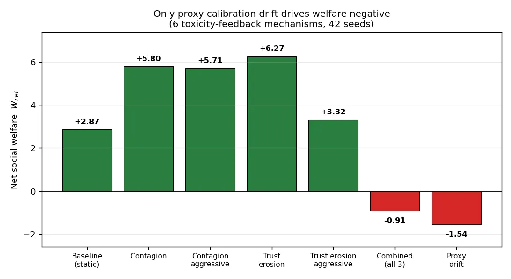
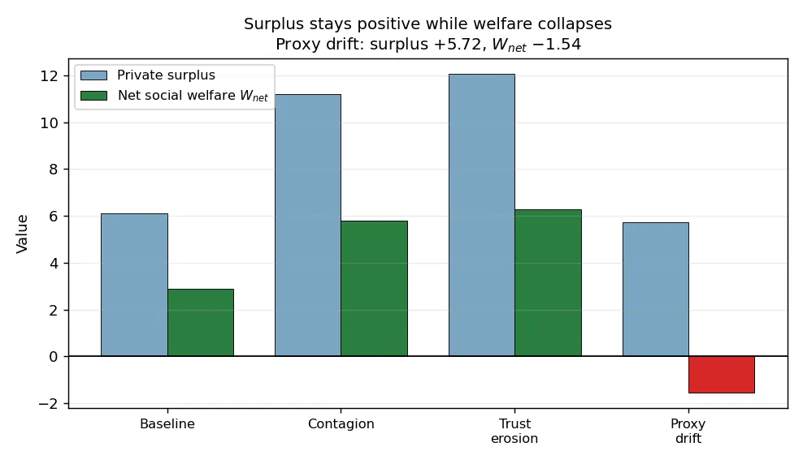

# Dynamic Toxicity Failure Modes: One Mechanism Out of Six Does All the Damage

*We tested six ways a multi-agent ecosystem can poison itself over time — trust erosion, quality contagion, proxy calibration drift, and aggressive/combined variants. Five were harmless or even mildly beneficial. One — proxy calibration drift — deterministically collapsed net social welfare from +2.87 to −1.54 across 42 seeds. And it did so while **private surplus stayed positive the entire way down**, which is the part that should worry you.*

---

Most safety work treats toxicity as a static property: an agent is harmful or it isn't, and you detect it or you don't. But real ecosystems have *feedback*. Bad interactions erode trust, low quality spreads, and — most insidiously — the very signal you use to detect harm can degrade as harm accumulates. We wanted to know which of these dynamic feedback loops actually matters. So we built six of them and ran them against a static baseline, 42 seeds each, Bonferroni-corrected.

The answer was lopsided. Five mechanisms did nothing or helped. One did everything.

## The six mechanisms

Each mechanism is a feedback rule layered on the same base governance setup (40% adversarial agents, circuit breaker τ=0.6, audit probability 0.1, reputation decay 0.95, 30 epochs):

- **Trust erosion** — honest agents exit when cumulative toxicity crosses a threshold.
- **Quality contagion** — low-quality interactions drag ecosystem-wide trust toward the floor.
- **Proxy calibration drift** — cumulative toxicity degrades the detector's sharpness: `sigmoid_k_t = sigmoid_k_0 − (cumulative_toxicity_t × α)`, with α=0.3.
- Plus **aggressive** variants of the first two, and a **combined** run with all three at once.

| Scenario | Net welfare | Surplus | Toxicity | Outcome |
|---|---:|---:|---:|:--:|
| Baseline (static) | **+2.87** | 6.12 | 0.294 | PASS |
| Contagion | +5.80 | 11.18 | 0.295 | PASS |
| Contagion aggressive | +5.71 | 10.96 | 0.296 | PASS |
| Trust erosion | +6.27 | 12.05 | 0.297 | PASS |
| Trust erosion aggressive | +3.32 | 7.55 | 0.321 | PASS |
| Combined (all 3) | −0.91 | — | 0.429 | FAIL |
| **Proxy drift (α=0.3)** | **−1.54** | 5.72 | 0.429 | **FAIL** |

*Net social welfare: `W_net = Σ_accepted [ p·s⁺ − (1−p)·(s⁻ + h) ]`, the harm-weighted quality of accepted interactions.*

Proxy drift is the **only single mechanism that produces negative welfare**. The combined run is also negative — but, as we'll see, that's just proxy drift carrying the other two.

## Why the other five don't matter

**Contagion is absorbed by memory decay.** Per-epoch reputation decay pulls trust back toward its 0.5 baseline faster than contagion can drag it down. The tell is saturation: aggressive contagion (γ=0.4) produces the *same* welfare as moderate contagion (γ=0.1) — +5.71 vs +5.80. Four times the contagion rate, zero additional damage. The signal is simply too weak to overcome the decay.

**Trust erosion needs you to already be near the cliff.** At 30% adversarial fraction, honest-agent exit produces measurable welfare *decline* (erosion's +6.27 is below contagion's +12.05 surplus) but not collapse. The mechanism only bites near an estimated phase boundary around 37.5–50% adversarial. Below that, the ecosystem absorbs the exits.

**The effects are additive, not synergistic.** This is the reassuring part of an otherwise grim result. If these mechanisms amplified each other, the combined run would be catastrophically worse than any single one. It isn't: combined welfare is −0.91, which is proxy drift's −1.54 *plus* about +0.63 of the (mildly positive) erosion/contagion contribution. The mechanisms add linearly. There's no hidden multiplicative blow-up — which means if you neutralize the dominant mechanism, you've neutralized most of the problem.

## Why proxy drift is different — and deterministic

Drift doesn't make agents more adversarial. It makes the *detector* worse, gradually, as a function of the toxicity it's supposed to be catching. As cumulative toxicity rises, `sigmoid_k` falls, and the classifier loses its ability to separate honest from adversarial agents. False positives rise (honest agents get penalized), true positives fall (adversaries slip through), and the acceptance mixture inverts.

The collapse is not noise. Across six seeds the welfare lands in a band from −1.39 to −1.69, σ ≈ 0.14:

| Seed | 1 | 2 | 3 | 4 | 5 | 42 |
|---|---:|---:|---:|---:|---:|---:|
| Net welfare | −1.69 | −1.50 | −1.68 | −1.39 | −1.42 | −1.54 |

That tight clustering is the signature of a **deterministic failure mode**, not a tail risk. Given the drift rule, the ecosystem collapses every time.

## The dangerous part: surplus lies

Here is the finding that should change how you read a governance dashboard. Under proxy drift, **private surplus stays positive (+5.72) while social welfare is negative (−1.54)**.

Surplus measures transaction *volume* — are agents trading? They are, more than ever, because the degraded detector accepts more deals. But `W_net` measures the *quality mixture* of what's accepted, and drift shifts that mixture toward adversarial counterparties. More trades, worse trades. A success criterion of "surplus ≥ 0" — or "toxicity below threshold," which also looks fine at 0.43 — would stamp this ecosystem **PASS** while it quietly destroys value.

This is why we report `W_net` (break-even at p=0.6 honest-fraction-among-accepted) rather than surplus or a raw toxicity threshold. The single most common way to miss a welfare collapse is to measure volume and call it health.

## Connection to our detection work

This result is the dark companion to our [soft-vs-binary detection post](soft-vs-binary-detection.md), which showed soft continuous metrics achieving near-perfect discrimination. The catch: that perfection is **static**. Proxy drift is precisely the dynamic that erodes it — cumulative toxicity degrades `sigmoid_k`, dragging the well-calibrated soft detector back toward the miscalibrated binary regime, with the welfare consequences above. The lesson across both posts is the same: **detector durability under drift matters more than peak accuracy**. A detector that's perfect on day one and uncalibrated by epoch 30 is not a safe foundation.

## Takeaways

1. **Don't budget equally across feedback mechanisms.** Five of six were harmless here; one carried the entire failure. Find the dominant mechanism and spend your defense there.
2. **Calibration drift is the one to fear** — it's deterministic, it's silent, and it targets the detector rather than the agents.
3. **Never gate on a volume metric alone.** Positive surplus and sub-threshold toxicity both said "safe" while welfare went negative. Measure the harm-weighted quality mixture.
4. **The open question is recalibration.** Can periodic recalibration arrest the collapse, and what's the critical α where it tips from reversible to deterministic? That's the next experiment.

---

*Source: `dynamic_toxicity_2026-03-28` (42 seeds, Bonferroni-corrected). Claims: `proxy-calibration-drift-collapse`, plus four related toxicity-dynamics claims. Raw run directories are archived to [swarm-artifacts](https://github.com/swarm-ai-research/swarm-artifacts).*

---

*Disclaimer: This post uses financial market concepts as analogies for AI safety research. Nothing here constitutes financial advice, investment recommendations, or endorsement of any trading strategy.*
