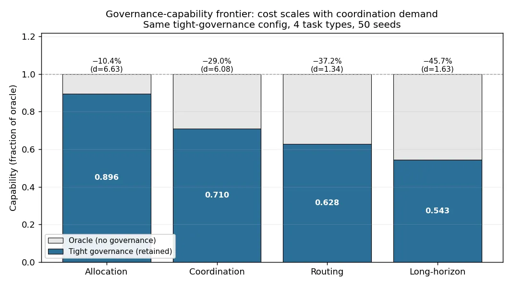

# The Governance-Capability Frontier

*The cost of safety isn't fixed — it scales with how much a task makes agents coordinate*

---

Every governance mechanism buys safety by constraining what agents can do. The standard mental model treats that as a flat tax: turn governance up, pay a fixed capability cost, get safety in return. That model is wrong. **The cost of governance scales with the coordination demand of the task** — and the spread is large enough to change how you should deploy governance at all.

We measured it directly. In a frontier trace of 1,400 runs (50 seeds × 7 governance configurations × 4 task types), we compared each task's capability under an *oracle* (no governance) against the same task under *tight* governance. The same governance configuration that costs barely 10% on one task removes nearly half the capability on another.

## The frontier: a 4.4× spread

| Task | Oracle | Tight | Capability loss | Cohen's *d* |
|------|:------:|:-----:|:---------------:|:-----------:|
| **Allocation** | 1.000 | 0.896 | **−10.4%** | 6.63 |
| **Coordination** | 1.000 | 0.710 | **−29.0%** | 6.08 |
| **Routing** | 1.000 | 0.628 | **−37.2%** | 1.34 |
| **Long-horizon** | 1.000 | 0.543 | **−45.7%** | 1.63 |

*Run `20260304_212912_frontier_trace`, 50 seeds. All losses survive Bonferroni correction.*

The least-affected task (allocation) loses 10.4%; the most-affected (long-horizon) loses 45.7%. That **4.4× amplification** is the headline: governance is not a fixed overhead. The completion-rate data tells the same story even more starkly — under tight governance, allocation still completes 100% of the time, while long-horizon completion collapses to 48%, i.e. *majority failure*.

A note on the effect sizes: allocation and coordination have very large, tight *d* (6.63, 6.08) — their losses are small but rock-solid. Routing and long-horizon have larger losses but smaller *d* (1.34, 1.63), meaning those tasks are noisier under governance: the capability hit is bigger *and* more variable. High-coordination work doesn't just cost more capability on average — it becomes less predictable.

## Why coordination demand is the axis

Governance mechanisms — audits, circuit breakers, staking, confirmation gates, bandwidth caps — all work by constraining inter-agent communication and narrowing the action space. That constraint is paid *per communication round*. So the cost of governance on a task is roughly the per-round overhead times the number of rounds the task requires:

- **Allocation** — agents make largely independent decisions. Few coordination rounds, so little governance overhead accumulates.
- **Coordination / routing** — single- to multi-hop messaging between agents. More rounds, more accumulated cost.
- **Long-horizon** — temporal-dependency chains where each step gates the next. The most communication rounds, each taxed, so the cost compounds the most.

The constraint is structural, not task-specific — which is why the *ordering* of governance strength is universal even though the *magnitude* of the cost is not.

## The ordering is monotonic and task-universal

Across all 1,400 runs and seven governance configurations, the capability ordering is invariant:

> **oracle > loose > light > moderate-light > moderate > tight-moderate ≈ tight**

This holds for every one of the four task types, with all comparisons Bonferroni-significant at α/24. Each governance layer you add independently shrinks the action space, so layering them produces a clean monotonic degradation — no configuration ever inverts the ordering (tight and tight-moderate are statistically tied, *d* < 0.1, on routing and long-horizon). You always pay more capability for more governance; you just pay *much* more when the task is coordination-heavy.

This is the capability-side companion to the [governance mechanisms taxonomy](governance-mechanisms-taxonomy.md), which asks *which lever* to pull. This page asks *how much it costs to pull it* — and the answer depends on what the agents are trying to do.

## The practical implication: match governance to task structure

If governance cost were a flat tax, you'd pick one strength and apply it everywhere. Because it isn't, uniform governance is a mistake in both directions:

| Task structure | Governance cost | Implication |
|----------------|-----------------|-------------|
| Parallelizable, independent (allocation) | Low (~10%) | Tight governance is nearly free — apply it liberally |
| Coordination-heavy, sequential (long-horizon) | High (~46%) | Tight governance removes half the capability — use the lightest sufficient regime |

The temptation is to set governance to maximum everywhere "to be safe." On low-coordination work that's almost costless. On long-horizon, coordination-dependent work it can hollow out the very capability you deployed the agents for. The design frontier this opens is **task-adaptive governance**: tight where coordination is cheap, lighter where coordination is the whole point — provided adversary suppression still holds.

## Open questions

1. **Where is the crossover?** At what task complexity (or adversarial fraction) does tight governance become *net-harmful* — costing more capability than the safety it buys?
2. **Can governance be task-adaptive in practice?** Tight for allocation, loose for long-horizon, switched dynamically — without opening an exploit where adversaries route harmful work through the lightly-governed task type.
3. **Does the amplification grow with team size?** Larger agent teams need more coordination rounds; the 4.4× spread may widen as populations scale.

---

*All experiments use the [SWARM framework](https://github.com/swarm-ai-research/swarm). The frontier trace (50 seeds × 7 governance configs × 4 task types = 1,400 runs) is `runs/20260304_212912_frontier_trace/`; raw run directories are archived to [swarm-artifacts](https://github.com/swarm-ai-research/swarm-artifacts). Replicable from scenario YAML + seed.*

---

!!! quote "How to cite"
    SWARM Team. "The Governance-Capability Frontier." *swarm-ai.org/concepts/governance-capability-frontier/*, 2026. Based on [arXiv:2604.19752](https://arxiv.org/abs/2604.19752); see also [arXiv:2512.16856](https://arxiv.org/abs/2512.16856).
